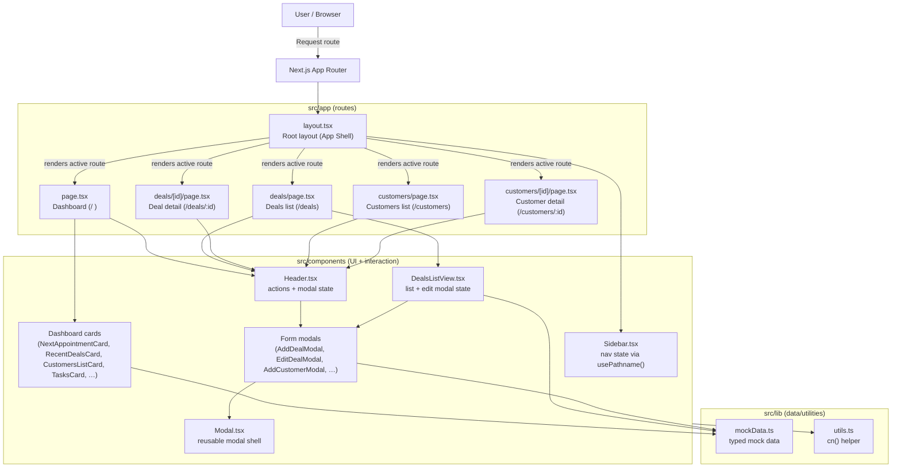

# UniSouk CRM Dashboard - Take Home Assignment

This repository contains the frontend implementation of the UniSouk CRM Dashboard based on the provided Figma layout.

## Tech Stack
- **Framework**: Next.js 16+ (App Router)
- **Styling**: Tailwind CSS v4 (Using the new inline CSS `@theme` architecture)
- **Language**: TypeScript
- **Icons**: `lucide-react`
- **Fonts**: Inter (via `next/font/google`)

## Architecture & Decisions
- **Layout System**: Used a robust Next.js Root Layout encompassing the fixed `Sidebar` and horizontal `Header`. The core content uses a 12-column CSS Grid responsive mapping (`grid-cols-1 xl:grid-cols-12`) mirroring the exact design grid properties.
- **Component Modularity**: Broke the dashboard into logical chunks (`NextAppointmentCard`, `TasksCard`, etc.) to maintain separation of concerns and ensure code scalability.
- **Mock Data**: Typed structures representing Deals, Customers, Tasks, and Project Progress are housed in `src/lib/mockData.ts` simulating a real API response shape.
- **Design Accuracy**: Used exact Tailwind `var` overrides based on the style guide provided (`--color-brand-blue`, `--color-brand-green`, etc.) implementing matching border radiuses, typography scaling, and soft multi-layered drop shadows.

## Architecture Diagram



## Running Locally
1. Clone the repository and navigate into this directory.
2. Install dependencies:
   ```bash
   npm install
   ```
3. Run the development server:
   ```bash
   npm run dev
   ```
4. Open [http://localhost:3000](http://localhost:3000) in your browser.

## AI Assistance
This project was built with the help of **[Antigravity IDE](https://antigravity.dev)** — an agentic coding environment — using **Claude Sonnet** (Anthropic) and **Gemini** (Google DeepMind) models. Their contributions included:

1. **Design interpretation** — Translating Figma snapshots into concrete Tailwind component layouts with accurate spacing, color tokens, and typography.
2. **Scaffolding** — Setting up the Next.js 16 App Router structure, installing dependencies, and wiring up the root layout.
3. **Component generation** — Producing typed React components (`NextAppointmentCard`, `DealsListView`, modals, etc.) with correct mock data bindings.
4. **Responsive design** — Iteratively adding mobile-first breakpoints, converting tables to card views, and converting the sidebar to a bottom nav on small screens.
